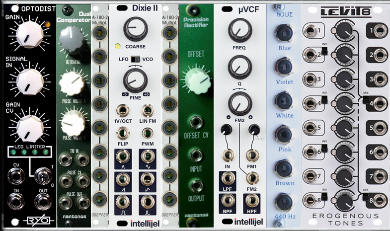

# the Ondes Martenot patch

## [Offsets](offsets/) (not yet built)

Custom module for pitch CV offset (dual shifted outputs). (Not yet shown in the modules picture).

- input 1 from pitchCV
- ultrafine tune (millivolt offset) and trimmable gain for precise 1V/octave tracking
- corrected pitchCV output to Dixie 2
- offset knob 1 +5V
- filter output 1 -> μVCF for gambe
- offset knob 2 +4V
- filter output 2 -> uVCF 2 for sine purifing

## Dixie 2

An Ondes oscillator needs accurate tracking over 9 octaves, a pure sine, and a good triangle. I'm using a commercial triangle-core oscillator by Intellijel,
which is known to have excellent stability and tracking.

- pitch CV in, from offsets
- sine out -> mult 3
- tri out -> mult 1

## Mult 1

This is the top half of a dual, 4-way passive mult.

- tri in from Dixie
- tri out 1 -> Dual Comparator
- tri out 2 -> Optodist

## [Dual Comparator](dual%20comparator/)

Custom module with dual comparators.

- tri in 1 from mult 1 (Dixie tri out)
- pulse width 1 knob (5%)
- pulse 1 -> ondesMix N in (Nasillard)
- pulse width 2 knob (45%)
- pulse 2 -> mult 2

This module also has an ultra-fine-tune for the Dixie 2.

## Optodist

Commercial DIY kit from RYO.

- tri in from mult 1 (Dixie tri out)
- soft clipping
- out -> ondesMix C in (Creux)

## Mult 2

Bottom half

- 45% pulse in from Dual Comparator
- pulse out 1 to ondesMix G in (Gambe)
- pulse out 2 to μVCF

## Mult 3

Top half of a second  dual 4-way passive mult.

- sine in from Dixie
- sine out 1 -> ondesMix O in (Onde)
- sine out 2 -> Precision Rectifier

Optionally, put sine out 1 into a second μVCF whose pitch is 4 octaves above.
Leaves fundamental, second and third harmonics but cuts higher harmonics. Would be better to use a clean 24db/oct filter, though.

## [Precision Rectifier](precision%20rectifier/)

Custom module for rectification (one level of wavefolding).

- input from mult 3 (Dixie sine)
- offset knob about 2 o'clock
- output -> ondesMix 8 in (Octaviant)

## μVCF

Commercial 12bB/oct clean-sounding filter from Intellijel, with good pitch tracking.

- in from mult 3 (40% pulse)
- fm1 from pitch CV offset 1, 5 octave offset
- low pass filter -> ondesMix g (petit gambe)

## Noise

Commercial noise source from Liivatera. Wide variety of modules suitable here.

pink -> ondesMix S in (Souffle)

## [ondesMix](wavemix/) (started, not yet complete)

Custom 7-input voltage-controlled mixer. Internally, two
cascaded 4-input mixers (so actually needs 8 CVs). Constructed from two L-1 4-input VCA mixer boards, custom balanced 8-input CV in, custom panel.

Possibly a need to submix N, C, G g for high-pass phase distortion,
would need a second pitch offset and second, HPF.

- 7 inputs from wave shapers etc
- 8 (balanced) CV inputs o DB-25 connector
- mix output -> VCA for articulation and volume control

I am currently using a Levit8 8-input mixer, until ondesMix build is complete.

# Outputs

A real ondes Martenot has four outputs, each routed to a different speaker or other transducer. In this implementation, I use:

- "principal" output to Exit Strategy (balanced out), power amp, powered speaker
- "resonnance" with a single-chanel VCA for volume, Music Thing Modular spring reverb, then to Exit Strategy
- "metallique" output to second Exit Strategy, second channel of power amp, resonator bolted to Chinese gong.
- "palme" still to-do (and hard to do).

## Currently missing

- keyboard with shake (using Roli Seaboard)
- bague (using Roli Seaboard glide)
- touche (using Roli Seaboard aftertouch)
- pins (designed, but not yet built)
- soft filter, controlled from tiroir or foot pedal, more of a mellow to sharp tone control
- switching and level controls for the 4 speaker sounds
- palme speaker, or digital emulation of one

