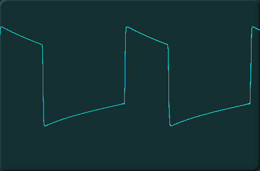
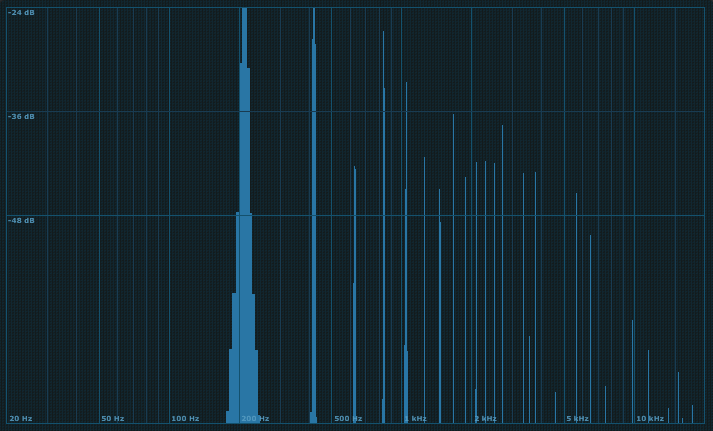
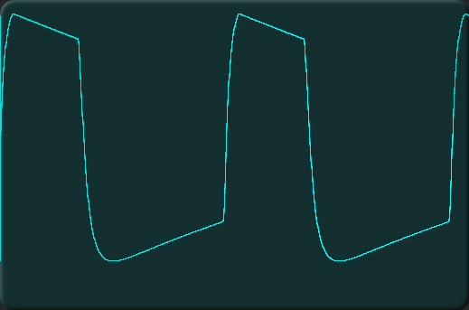
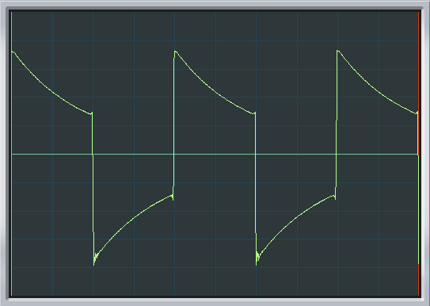
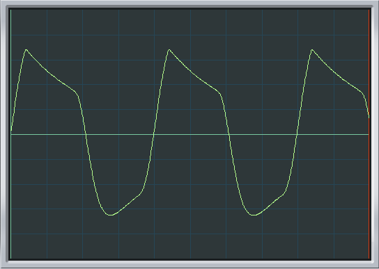
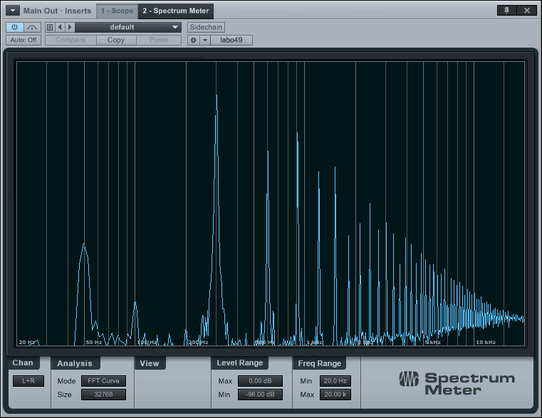

# Gambe (G and g)

## The real thing

## Gambe

 

## petit gambe

 

Scope shots and spectra of attempts to emulate the ondes Martenot Gambe (G) and Petit
Gambe (g) waveforms.

The spectra are scaled with 0dBFS at the top and -96dbFS at the bottom; frequencies
go from 20Hz to 20kHz although the FFT is unreliable much below 50Hz.

## Dixie square with HP and LP filters

Square wave from the Intellijel Dixie 2 VCO being fed through a
highpass filter (A-106-5, input level 4)
with the cutoff __below__ the fundamental, to phase shift the harmonics giving a tilted
top to the wave (G).

 

This is then lowpass filtered (A-122, input level 6) to remove higher harmonics
for the petit Gambe.

 

Results are moderately good for G (though with some hum and noise); more work needed
for g.

## Conclusion

The phase shift in the original gives a characteristic tilted top, but sound the same with and without this processing.

The original uses a 45% mark/space ratio, not a square. Will be created by [dual comparator](../../dual%20comparator).

**todo** repeat with Intellijel μVCF as LP filter, no HP filter, and 45% pulse wave.