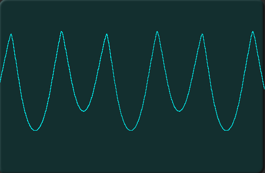
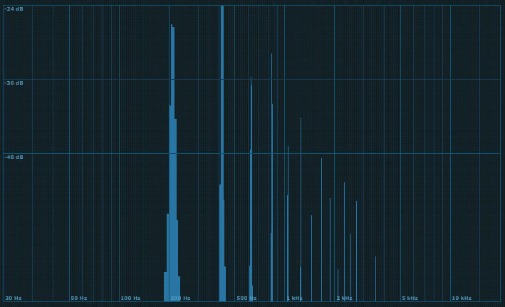
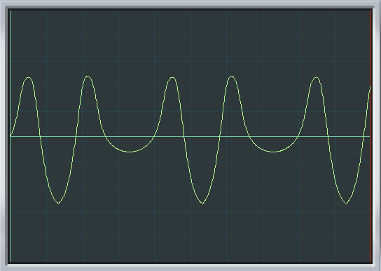
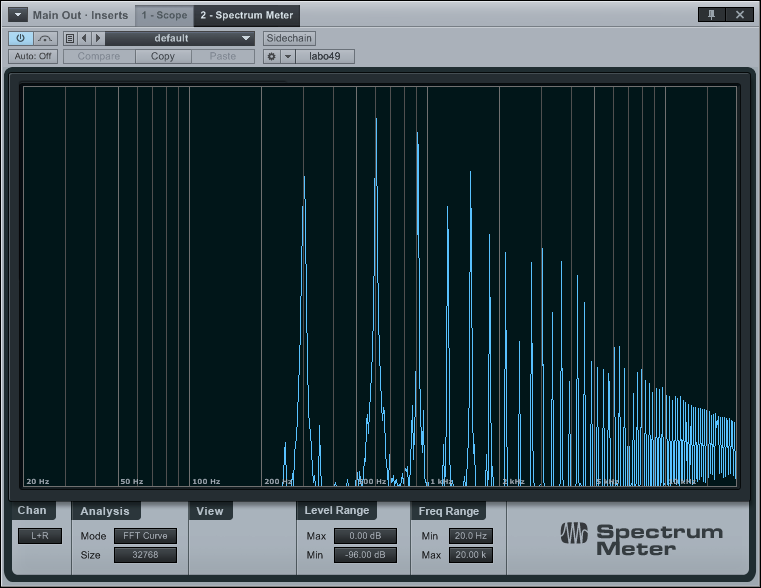
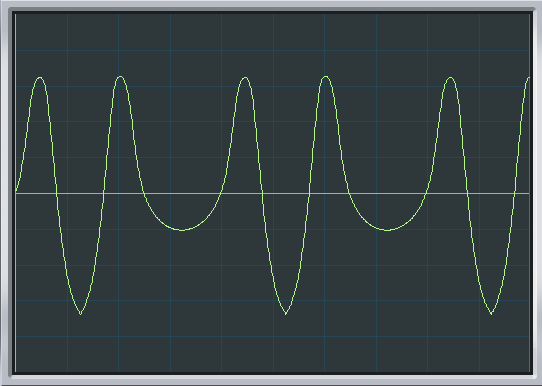
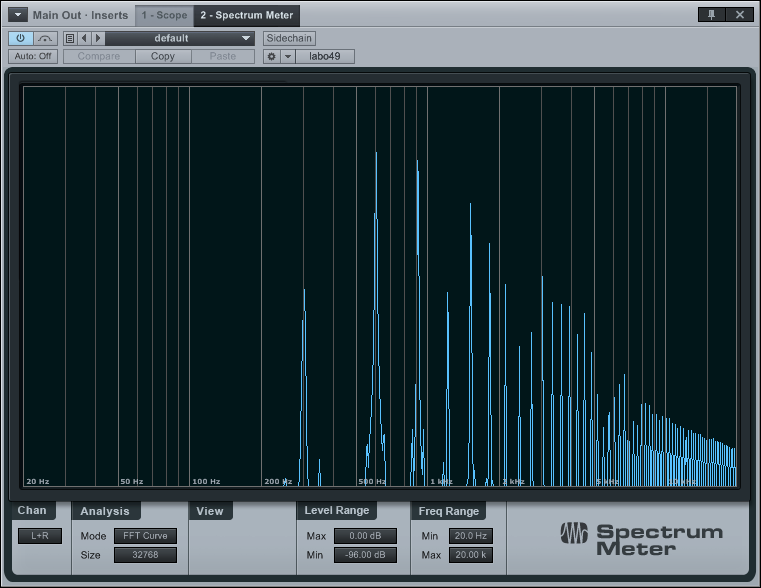
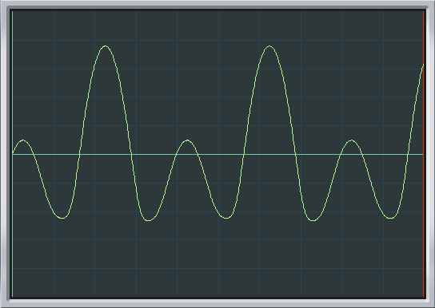
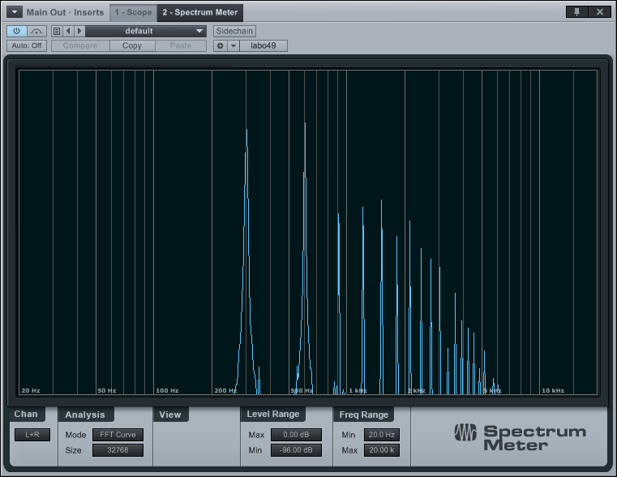

# Octaviant

## The real thing

Scope shots and spectra of attempts to emulate the ondes Martenot Octaviant (8) waveform, which is a sine wave folded to emphasise the second harmonic above the level of the fundamental.

 

The FFT spectra are scaled with 0dBFS at the top and -96dbFS at the bottom; frequencies
go from 20Hz to 20kHz although the FFT is unreliable much below 50Hz.

A prominent third harmonic is visible, with some secod, and rolling off rapidly above the fourth harmonic.

## with the uFold

Sine from the Intellijel Dixie 2 VCO fed into an Intellijel μFold waveshaper set to
a single folding stage, very small folding amount, with some offset so that only
the top is folded.

Result (two attempts, the first (octish) adjusted while looking at the scope:

 

and the second
(octish2)  adjusted while looking at the spectra and maximizing second harmonic):

 

Moderately
good for octish2, although the fold is less sharp from the μFold than on the ondes Martenot and there are too many of the upper harmonics.

A third attempt used a purer, filtered sine (A-122 lowpass) without noticeably better results.

 

## Conclusion

The main issue here is the folding. The Intellijel uFold is not a good match in this application. Accordingly a [precision rectifier](../../precision%20rectifier) module was constructed.

**todo** scope shots and spectra with the precision rectifier.