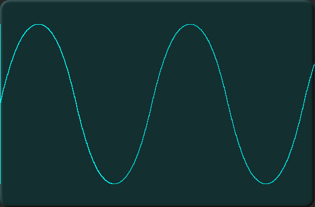
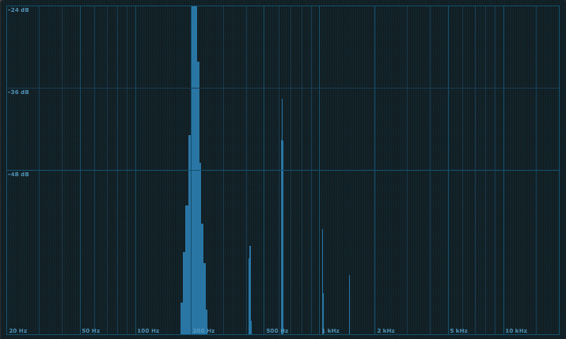
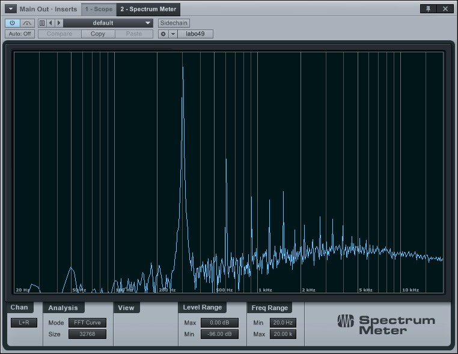
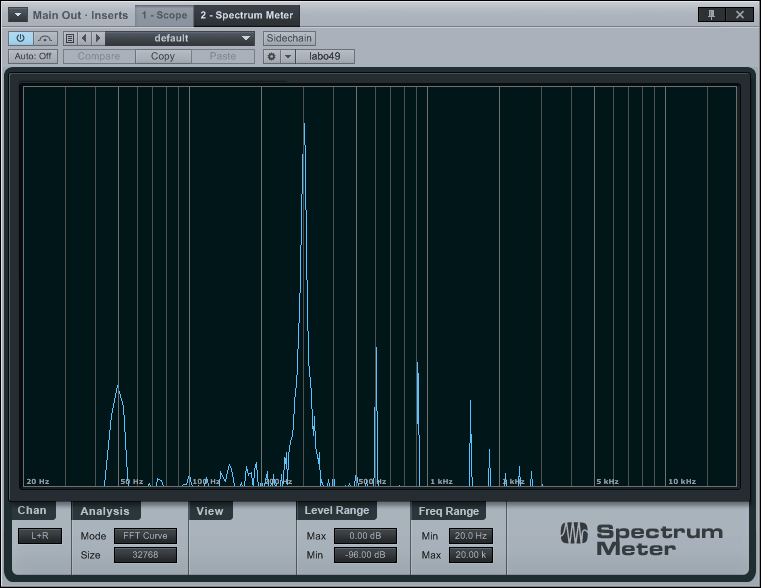
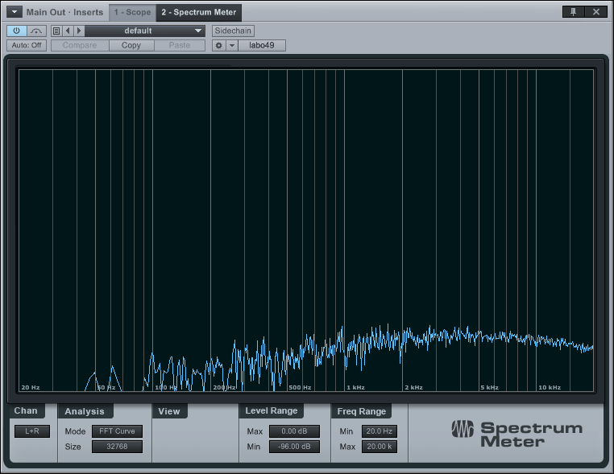
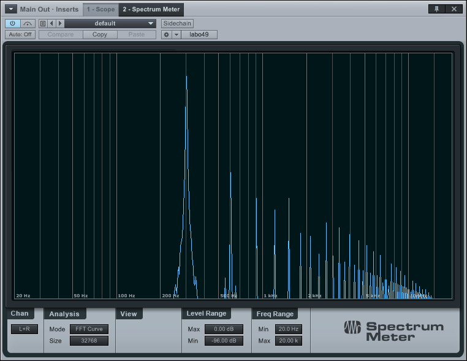
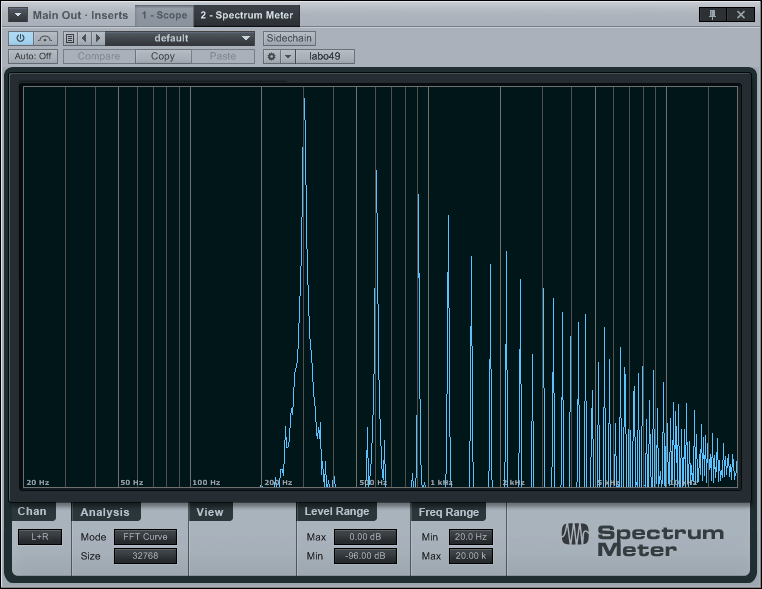
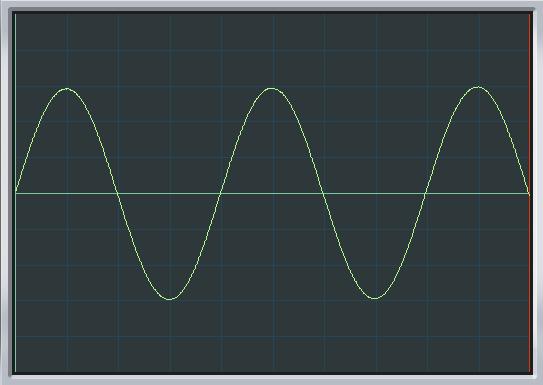
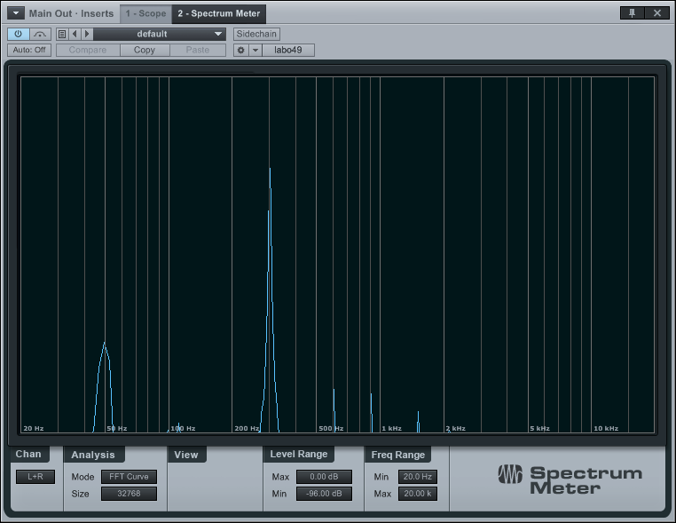
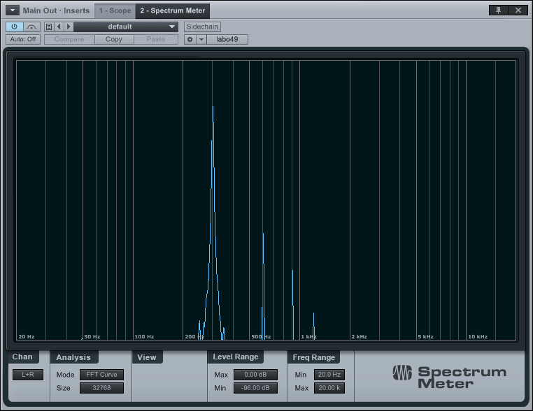

# Onde (sine)

## The real thing

 

## Dixie plus VCF

Scope shots and spectra of the sine output from Intellijel Dixie 2 VCO, filtered by
lowppass Voltage Controlled Filter (VCF) to remove higher harmonics.

The spectra are scaled with 0dBFS at the top and -96dbFS at the bottom; frequencies
go from 20Hz to 20kHz although the FFT is unreliable much below 50Hz.

Two filters are used here, the Doepfer A-105-6 12db/octave state variable filter
(LM13700 based) and the Doepfer A-122 24db/octave lowpass (CEM 3320 based).

### Doepfer A-105-6

At input level 4 (very low), the sine is cleaned up but there is a lot of noise pickup, the output level is also very low and would need boosting.

At input level 7, severe distortion is evident. This is the opposite of cleanup!

A-105-6 in low pass mode increases noise and saturation substantially, even with the input level at
4 out of 10, and also picks up significant 50Hz mains hum. Here with no input:

The 105-6 filter is completely unsuitable for this application.

### Doepfer A-122

At input level 5, but with no filtering applied (cutoff frequency well above input frequency):

while at level 7, distorion is clear:

Again at input level 5, but now with a high amount of filtering:

 

and at level 5 but with more moderate filtering of the higher harmonics

The A-122 slightly increases 3rd harmonic (which is fine, in this application) and slightly rolls off from 15kHz onwards even
when fully open, but is generally very clean at an input level of 5/10 and below. At minimum
resonance and with medium levels of filtering (cuttoff 2 to 3 octaves above fundamental)
a substantially cleaned-up sine is produced with distortion mainly second and third harmonic.

### Intellijel μVCF

Intellijel μVCF 12dB/octave SVF (Coolaudio V2164 based) would be interesting to try for this application. It
might be cleaner, but the 24db/octave of the A-122 probably makes it the better choice here.

### Doepfer A-105

This is a 24dB/octave using the SSM filter chip SSM2044. There is also the quad filter A-105-4, again with SSM2044.

