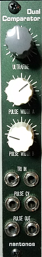
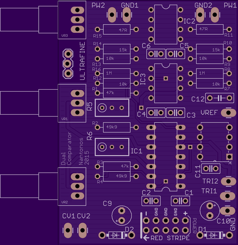

# Dual Comparator

## Introduction

This 6HP dual module is a pair of simple comparator circuits, which turns triangle waves into a pulse waves with variable mark/space ratio. It takes two audio inputs and two control voltages, compares them, and outputs the result. If a CV is not patched, a variable voltage is used (derived frm a voltage reference and a pot).

If the input waveform is a triangle wave, the output is a pulse wave with a variable mark-space ratio controlled by the CV.

I needed this because the Ondes Martenot has two pulse waveforms: Gambe and Nasillard.
Gambe is roughly a pulse wave with 45% mark/space. (Petit gambe is a lowpass-filtered version of Gambe).
Nasillard is another pulse, but with around 5% mark/space.

## Features

- two audio ins (in2 normalized to in1)
- two PW cv ins (normalized to 5V)
- two pulse outputs
- two pots, for attenuverters

## Implementation

- two trimmers, to null attenuverter
- low cost 195 5V ref (direct to norm pots)
- two audio input buffers (2 audio) TL074
- two CV attenuverters (other half of 074)
- LT1213 dual op-amp as comparator
- 470R/680R resistive divider converts +/- 12V output to+/- 5V output with 470R output impedance, 1213 can provide 30mA so no issue. 10mA drawn per divider though! Or 1k/1k5 (5ma, 1k output resistance). Volt swing and slew rate of comparator is reduced by current draw.
- two output buffers (TL072).
- small pcb with just 2 pots. 6 jacks wired to pcb.

[Schematic (PDF)](schematic.pdf)

 ([PDF](board.pdf))

]

[Bill of Materials](dual_comparator_BOM.md)

Front panel [FPD](./dual_comparator.fpd)

## Special Bonus Feature

This module was designed to sit next to an Intellijel Dixie 2 oscillator, providing an additional two pulse waveforms. The Dixie 2 has coarse and fine tune pots, and also on the PCB a three-pin connector for an optional, third, ultrafine tune. There was spare space on this module so I added a handy ultra-fine-tune pot. There are no jacks for this, use a 3-pin jumper cable to go from the internal 3-pin connector
to the 3-pin ultrafine connector on the Dixie.

This is utterly unrelated to the comparator functionality.
