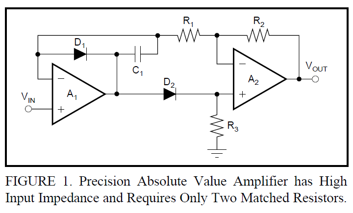
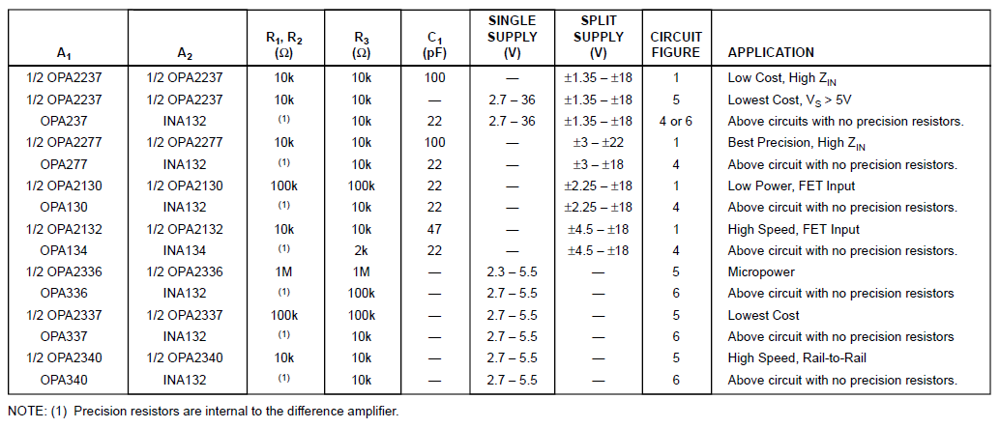
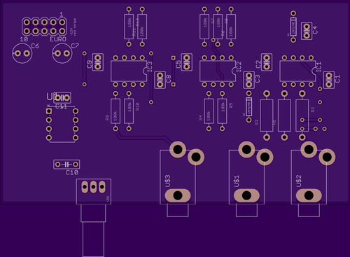
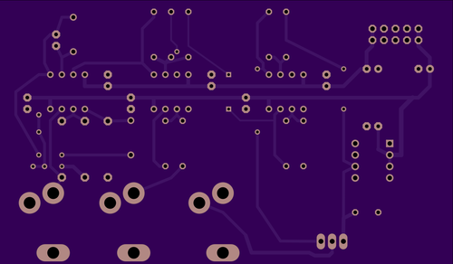
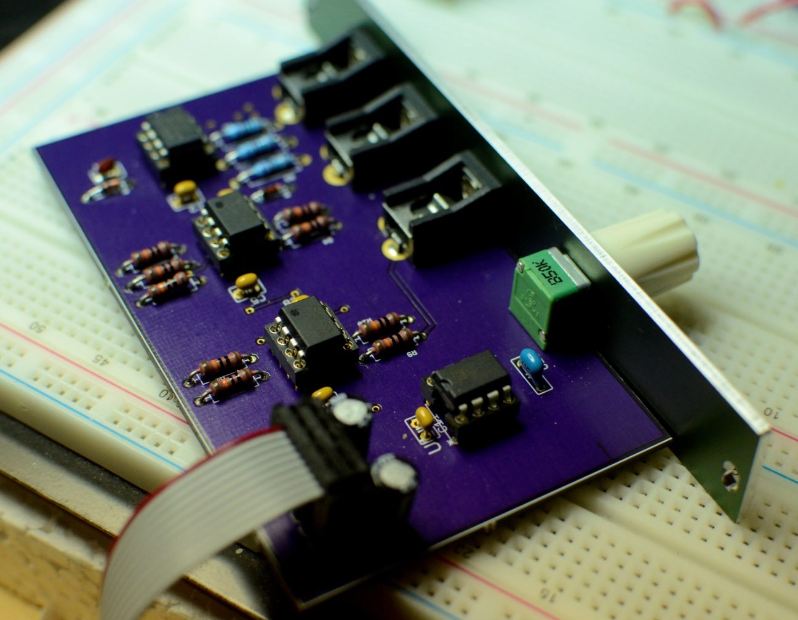
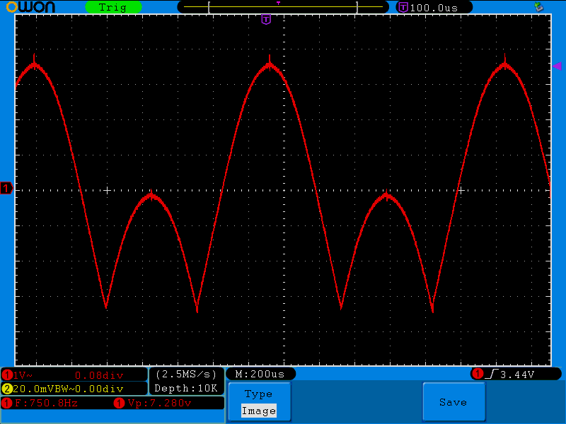

# Octaviant wavefolder

This module is to produce the Ondes Martenot "Octaviant" waveform.

## First attempt - μFold

I was originally using the Intellijel μFold II for this purpose
http://www.modulargrid.net/e/intellijel-%CE%BCfold-ii

However, while this is a great module in general, for this specific
application it was not a good fit. The settings needed (2 folds,
almost minimal amount, some offset) were near one end of the module
range, and the resulting waveforms were smooth topped rather than sharply
folded as with the original.

In a real Ondes Martenot, this waveform is made with a bridge rectifier.
Because of the high voltages used, diode drops have little effect in the original circuit, while they would havea detrimental effect at Eurorack voltage levels.
Thus it seemed that a "precision rectifier" (which uses diodes in the
feedback loop of an op-amp, to eliminate the effect of diode drops) would
be a suitable replacement.

## Precision rectifier design

The rectifier circuit used here is not original and is straight from a
Burr-Brown application note ["PRECISION ABSOLUTE VALUE CIRCUITS"](http://www.ti.com/lit/an/sboa068/sboa068.pdf) by
David Jones and Mark Stitt, figure 1.

Following their table of op-amp choices, a fast OPA2134PA is used so that the
output circuit is glitch-free up to 20kHz. Because Jones & Stitt recommend
closely matched resistors in the precision rectifier, 0.1% metal film is
used at those locations.

The remainder of the circuit is a Eurorack power connector, a low-cost 5V
voltage reference for the offset, and an inverting op-amp to give -5V. A
front-panel potentiometer thus gives a continuously variable +5V to -5V offset.
TL072 is used as there are no particular requirements on the op-amps here
besides good buffering (so, FET input).

The value from the pot is normaled to the offset CV input jack socket, so with
no cable connected the pot value is used.

The input audio signal is buffered with an inverting op-amp then added to
the offset with an inverting summer (thus restoring the phase).

## Schematic & Layout

- [schematic (pdf)](offset_rectifier.pdf)
- [Eagle schematic](offset_rectifier.sch)
- [Eagle board](offset_rectifier.brd)
- [Mill of Materials](BOM.md)

The board was made at OSH Park.

Completed module:

Scope output, showing sharply-filded sine like the original Ondes Martenot waveform.

