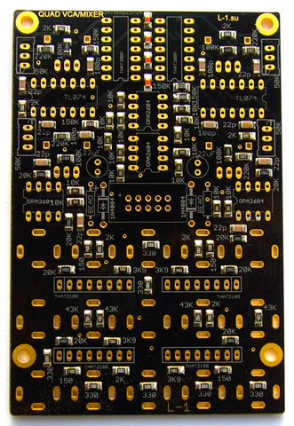
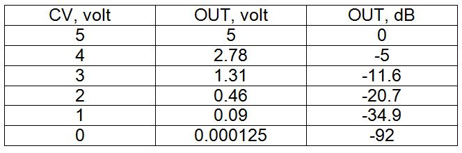

# WaveMix

This is a seven-input waveform mixer using THAT 2180 VCAs, with OPA 2604 for the mixers.

The module is a simple repanelling of a pair of  L-1 2180 VCA/mix boards.

The output of the first mixer is used as a submix send. The submix return uses one of the four inputs on the second board.

Because of this, eight
CVs are needed: four for the first four waveforms (the flat-topped ones, N C G g) which are submixed and sent to the
mixer send. This is normalled to mixer return together with the other three waveforms (O, 8, S) for a second, four
to one mixdown. Therefore the eighth CV is for submix level.

Because the [wavemix controller](../wavemix%20controller/) will be in a separate skiff, it is better to use balanced connection to transfer CVs. 8 balanced lines fit on a Tascam DB-25 connector. Use the Hinton impedance-balanced circuits with close-tolerance matched resistors.

The VCA response is somewhere between linear and logarithmic. From the designer, here is a the response table:

